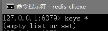
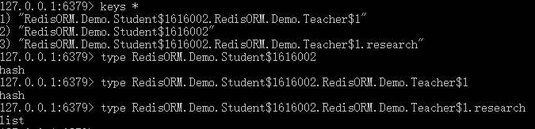
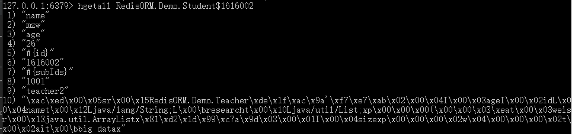
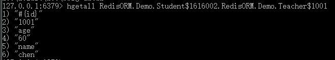
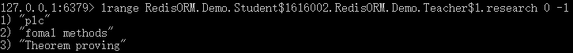
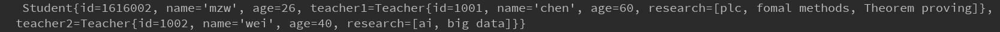

[TOC]

# 使用示例

## 首先是要操作的类

### Teacher

```java
import RedisORM.annotations.*;
import java.io.Serializable;
import java.util.List;

// 若以@RSerialize(id="teacher") 来注解表示这个类使用序列化的方式保存
// 以RHash来注解类，表明这个类在Redis中以一个hash类型保存
@RHash(id="teacher")
public class Teacher implements Serializable{

    // 这个字段注解为RKey,表示这个字段是主键，以id为key,以其值为value作为一个键值对保存到Redis的一个hash类型中
    @RKey
    private int id;

    // 这个字段注解为RField,表示这个字段映射为Redis中hash类型中的键值对
    @RField
    private String name;

    @RField
    private int age;

    // 这个字段注解为RList,表示这个字段在Redis中以list类型来保存
    @RList
    private List<String> research;

    // 构造方法及字段的set、get函数
}
```

### Student

```java
// 以RHash来注解类，表明这个类在Redis中以一个hash类型保存
@RHash(id="student")
public class Student implements Serializable{
    // 这个字段注解为RKey,表示这个字段是主键，以id为key,以其值为value作为一个键值对保存到Redis的一个hash类型中
    @RKey
    private  int id;

    // 这个字段注解为RField,表示这个字段映射为Redis中hash类型中的键值对
    @RField
    private String name;

    @RField
    private int age;

    // 这个字段注解为RHash,表明这个字段需要使用一个hash类型来保存
    @RHash(id="teacher")
    private Teacher teacher1;

    @RSerialize(id="teacher")
    private Teacher teacher2;

    // 构造方法及字段的set、get函数
}

```

## 配置文件

### Demo.xml

```xml
<redis>
    <!-- 配置设置 -->
    <settings>
        <!-- 是否开启懒加载L:开启 -->
        <lazyload>true</lazyload>
        <!-- 设置Cache:淘汰策略为最近最久未使用；刷新时间为：60000ms；缓存大小：512个对象；是否只读：只读 -->
        <cache eviction="lru" flush="60000" size="512" readonly="true"/>
    </settings>

    <!-- 配置别名,简化后面配置的书写 -->
    <typeAlias>
        <alias name="teacher" javaType="RedisORM.Demo.Teacher"/>
        <alias name="student" javaType="RedisORM.Demo.Student"/>
    </typeAlias>

    <!-- 配置数据源 -->
    <datasource>
        <!-- 数据源主机地址 -->
        <host>localhost</host>
        <!-- 主机端口 -->
        <port>6379</port>
        <!-- 最大连接数量为:30，最大等待链接数量为:10 -->
        <pooled maxtotal="30" maxidle="10">true</pooled>
    </datasource>

    <!-- Redis类型与类字段的映射 -->
    <mappers>
        <!-- 配置Student类的映射 -->
        <hash id="teacher" javaType="teacher">
            <key property="id" />
            <field property="age" />
            <field property="name" />
            <list property="research" />
        </hash>
    </mappers>

    <!-- 扫描指定类的注解 -->
    <scan>
        <class type="student"/>
    </scan>

</redis>
```

## 使用框架来操作数据

### 首先查看Redis中的数据




### 然后使用框架来保存

```java
public static void main(String[] args) {

        // 创建配置类
        Configuration configuration = new Configuration("Demo.xml");
        // 创建会话工厂
        SessionFactory sessionFactory = new DefaultSessionFactory(configuration);
        // 创建会话
        RedisSession session = sessionFactory.opSession();

        // 创建teacher1对象
        List<String> research1 = new ArrayList<>();
        research1.add("Theorem proving");
        research1.add("fomal methods");
        research1.add("plc");
        Teacher teacher1 = new Teacher(001,"chen",60,research1);

        // 创建teacher2对象
        List<String> research2 = new ArrayList<>();
        research2.add("ai");
        research2.add("big data");
        Teacher teacher2 = new Teacher(001,"chen",60,research2);

        // 创建student对象
        Student student = new Student(1616002,"mzw",26,teacher1,teacher2);

        // 执行保存操作
        session.save(student);

        // 提交事务
        session.exec();

    }
```

### 再查看Redis中的数据

可以看出当student对象保存到了Redis中后，Redis中多了三条数据

1. RedisORM.Demo.Student$1616002：就是student对象在Redis中的数据，它是hash类型。其中RedisORM.Demo.Student表示这个对象属于的类，1616002表示student的id。
2. RedisORM.Demo.Student$1616002.RedisORM.Demo.Teacher\$1001：student中字段teacher1的数据。
3. RedisORM.Demo.Student$1616002.RedisORM.Demo.Teacher$1001.research：teacher1中的字段research的值。




接着在查看数据中的内容：

1. RedisORM.Demo.Student$1616002：



​	这是student中的键值对，从键值对中可以看到对象中字段的值，其中teacher2是以序列化的方式保存，所以它的数据是二进制的数据。

2. RedisORM.Demo.Student$1616002.RedisORM.Demo.Teacher\$1:



​	这是student中teacher1字段的值，从这里可以看到teacher1字段对应的对象的所有值。

3. RedisORM.Demo.Student$1616002.RedisORM.Demo.Teacher\$1.research:



​	这是teacher1对象中research字段的值。

### 使用框架来获取数据

```java
public static void main(String[] args) {

       // 创建配置类
        Configuration configuration = new Configuration("Demo.xml");

        // 创建会话工厂
        SessionFactory sessionFactory = new DefaultSessionFactory(configuration);
        // 创建会话
        RedisSession session = sessionFactory.opSession();

        // 获取对象
        Student student = session.get(Student.class,1616002);

        // 打印对象，查看数据
        System.out.println(student);

        session.exec();
    }
```

#### 得到的对象的数据



从图中可以看出，框架已经自动生成一个对象返回给用户。

##查看日志

###开启框架时的日志

```properties
2018-09-14 10:21:19  [ main:0 ] - [ DEBUG ]  【--start parsing configuration file--】
  2018-09-14 10:21:19  [ main:48 ] - [ DEBUG ]  ----read configuration file: F:\MyBatisSrc\RedisORM\target\test-classes\Demo.xml
  2018-09-14 10:21:19  [ main:190 ] - [ DEBUG ]  ----start parsing <settings>
  2018-09-14 10:21:19  [ main:193 ] - [ DEBUG ]  --------start parsing <parse>
  2018-09-14 10:21:19  [ main:197 ] - [ DEBUG ]  --------start parsing <lazyload>
  2018-09-14 10:21:19  [ main:197 ] - [ DEBUG ]  ------------lazyload is 'true'
  2018-09-14 10:21:19  [ main:198 ] - [ DEBUG ]  --------start parsing <cache>
  2018-09-14 10:21:19  [ main:199 ] - [ DEBUG ]  ------------eviction is: lru
  2018-09-14 10:21:19  [ main:201 ] - [ DEBUG ]  ------------flush is: 60000ms
  2018-09-14 10:21:19  [ main:201 ] - [ DEBUG ]  ------------size is: 512
  2018-09-14 10:21:19  [ main:202 ] - [ DEBUG ]  ------------readonly is: true
  2018-09-14 10:21:19  [ main:202 ] - [ DEBUG ]  ----start parsing <datasource>
  2018-09-14 10:21:19  [ main:205 ] - [ DEBUG ]  --------create pooledDataSource
  2018-09-14 10:21:19  [ main:368 ] - [ DEBUG ]  ----start parsing <typeAlias>
  2018-09-14 10:21:19  [ main:393 ] - [ DEBUG ]  --------add alias:'teacher' to typeAlias
  2018-09-14 10:21:19  [ main:393 ] - [ DEBUG ]  --------add alias:'student' to typeAlias
  2018-09-14 10:21:19  [ main:396 ] - [ DEBUG ]  ----start parsing <mappers>
  2018-09-14 10:21:19  [ main:399 ] - [ DEBUG ]  --------start parsing mapper:'teacher'
  2018-09-14 10:21:19  [ main:409 ] - [ DEBUG ]  --------finish parsing mapper:'teacher'
  2018-09-14 10:21:19  [ main:410 ] - [ DEBUG ]  ----start parsing <scan>
  2018-09-14 10:21:19  [ main:416 ] - [ DEBUG ]  --------parsing class: 'student'
  2018-09-14 10:21:19  [ main:443 ] - [ DEBUG ]  【--start building executor--】
  2018-09-14 10:21:19  [ main:466 ] - [ DEBUG ]  ----building HashItem: RedisORM.Demo.Teacher
  2018-09-14 10:21:19  [ main:470 ] - [ DEBUG ]  --------building FieldItem
  2018-09-14 10:21:19  [ main:471 ] - [ DEBUG ]  ------------building FieldItem: 'age'
  2018-09-14 10:21:19  [ main:499 ] - [ DEBUG ]  ------------building FieldItem: 'name'
  2018-09-14 10:21:19  [ main:501 ] - [ DEBUG ]  --------building ListItem: 'research'
  2018-09-14 10:21:19  [ main:505 ] - [ DEBUG ]  --------building SerializeItem
  2018-09-14 10:21:19  [ main:505 ] - [ DEBUG ]  ----building HashItem: RedisORM.Demo.Student
  2018-09-14 10:21:19  [ main:505 ] - [ DEBUG ]  --------building FieldItem
  2018-09-14 10:21:19  [ main:506 ] - [ DEBUG ]  ------------building FieldItem: 'name'
  2018-09-14 10:21:19  [ main:507 ] - [ DEBUG ]  ------------building FieldItem: 'age'
  2018-09-14 10:21:19  [ main:507 ] - [ DEBUG ]  --------building SerializeItem
  2018-09-14 10:21:19  [ main:508 ] - [ DEBUG ]  ------------creating SerializeItem: 'teacher2'
  2018-09-14 10:21:19  [ main:514 ] - [ DEBUG ]  --------start building Cache

```

###保存时的日志

```properties
  2018-09-14 10:21:19  [ main:560 ] - [ DEBUG ]  start saving:RedisORM.Demo.Student
  2018-09-14 10:21:19  [ main:577 ] - [ DEBUG ]  $$$$$$$$$ hset RedisORM.Demo.Student$1616002 name
  2018-09-14 10:21:19  [ main:577 ] - [ DEBUG ]  $$$$$$$$$ hset RedisORM.Demo.Student$1616002 age
  2018-09-14 10:21:19  [ main:578 ] - [ DEBUG ]  $$$$$$$$$ hset RedisORM.Demo.Student$1616002.RedisORM.Demo.Teacher$1001 age
  2018-09-14 10:21:19  [ main:579 ] - [ DEBUG ]  $$$$$$$$$ hset RedisORM.Demo.Student$1616002.RedisORM.Demo.Teacher$1001 name
  2018-09-14 10:21:19  [ main:583 ] - [ DEBUG ]  $$$$$$$$$ lpush RedisORM.Demo.Student$1616002.RedisORM.Demo.Teacher$1001.research
  2018-09-14 10:21:19  [ main:608 ] - [ DEBUG ]  $$$$$$$$$ hset<byte> RedisORM.Demo.Student$1616002 teacher2
  2018-09-14 10:21:19  [ main:610 ] - [ DEBUG ]  ----Put <RedisORM.Demo.Student:1616002> to Cache
  2018-09-14 10:21:19  [ main:611 ] - [ DEBUG ]  finish saving:RedisORM.Demo.Student
```

###获取时的日志

```properties
  2018-09-14 10:23:26  [ main:546 ] - [ DEBUG ]  Cache Hit Ratio: 0.0 and get: <RedisORM.Demo.Student:1616002>
  2018-09-14 10:23:26  [ main:546 ] - [ DEBUG ]  start getting [RedisORM.Demo.Student] which id is: 1616002 from Redis
  2018-09-14 10:23:26  [ main:737 ] - [ DEBUG ]  finish getting [RedisORM.Demo.Student] which id is: 1616002 from Redis
  2018-09-14 10:23:26  [ main:738 ] - [ DEBUG ]  ----Put <RedisORM.Demo.Student:1616002> to Cache
  2018-09-14 10:23:26  [ main:738 ] - [ DEBUG ]  ----load other field: 
  2018-09-14 10:23:26  [ main:742 ] - [ DEBUG ]  $$$$$$$$$ hget<byte> RedisORM.Demo.Student$1616002 RedisORM.Demo.Student$1616002
  2018-09-14 10:23:26  [ main:764 ] - [ DEBUG ]  $$$$$$$$$ hget RedisORM.Demo.Student$1616002 name
  2018-09-14 10:23:26  [ main:766 ] - [ DEBUG ]  $$$$$$$$$ hget RedisORM.Demo.Student$1616002.RedisORM.Demo.Teacher$1001 age
  2018-09-14 10:23:26  [ main:767 ] - [ DEBUG ]  $$$$$$$$$ hget RedisORM.Demo.Student$1616002.RedisORM.Demo.Teacher$1001 name
  2018-09-14 10:23:26  [ main:767 ] - [ DEBUG ]  $$$$$$$$$ lrang RedisORM.Demo.Student$1616002.RedisORM.Demo.Teacher$1001.research 0  -1
  2018-09-14 10:23:26  [ main:768 ] - [ DEBUG ]  $$$$$$$$$ hget RedisORM.Demo.Student$1616002 age
```


