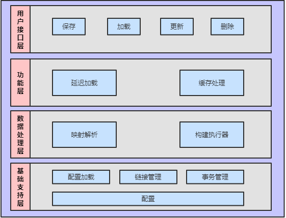

[TOC]

## RedisNOS(Redis not only serialization)

本框架类似于Hibernate、Mybatis这些ORM框架，具有自动保存对象和装配数据的功能，可以将对象以序列化、非序列化、混合的方式自动地保存到Redis中，也可以将Redis中的数据自动装配成对象返回给用户。

通常在使用Redis来保存对象作为缓存时使用的方法是将对象==序列化的方式保存==。这样做的==缺点==是：
1. 序列化过程复杂，消耗时间。
2. 序列化会将无用的信息一并序列化，造成CPU、内存的浪费，即使在类中定义了序列化方法，当需求发生变化后，需要重新更改代码，十分麻烦。
3. 序列化保存后的数据是二进制数据，我们无法在Redis中直接查看其中的值，更不能直接修改对象中的某些值。

本框架实现了Redis上的对象存储，可以将对象以==序列化、非序列化、混合的方式==自动地保存到Redis中。使用本框架可以消耗更少的CPU资源和内存资源。本框架也可以利用Redis的各种特性来完成多种功能。

本框架提供了XML和注解两种配置方式来让用户配置一个类中需要保存的字段，以及字段保存的方式。在保存对象时，框架会根据用户的配置将对自动地保存到Redis中；在获取对象时，也会自动从Redis中获取数据并组装成一个对象返回给用户。

框架除了基础的数据保存与获取功能外，还有缓存、延迟加载、事务等功能，使得框架的效率更高，更安全。

## 框架的架构
 

## 框架中的模块

### 1.annotations

框架中可以使用的注解有：

#### 1.RField

​	此注解可以注解在类变量上，表明这个变量的将以<变量名，变量值>的键值对形式保存在Redis的一个hash类型的数据中。

​	在Redis中的key为：ParentClass\$id.ClassName$id中的  fieldname

#### 2.RKey

​	此注解可以注解在类的变量上，表明这个变量是作为一个对象的id来标识对象的身份，类似于数据库中的主键，它也是<变量名，变量值>的键值对形式保存在Redis的一个hash类型的数据中。

​	在Redis中的key为：ParentClass\$id.ClassName$id中的  #{id}

#### 3.RList

​	此注解可以注解在类的变量上，表明这个变量的值以一个list类型的数据来保存，一般被注解的变量的类型为List类型。

​	在Redis中的key为：ParentClass\$id.ClassName$id.fieldname

#### 4.RSet

​	此注解可以注解在类的变量上，表明这个变量的值以一个set类型的数据来保存，一般被注解的变量的类型为Set类型。

​	在Redis中的key为：ParentClass\$id.ClassName$id.fieldname

#### 5.RString

​	此注解可以注解在类的变量上，表明这个变量以string类型的来保存。

​	在Redis中的key为：ClassName$fieldname

#### 6.RSerialize

​	此注解可以用在类和类变量上。

​	用在类上表示这个类使用序列化的方式保存。

​	用在类变量上表示这个变量使用序列化的方式保存。

​	在Redis中的key为：ClassName$serialize\$id

#### 7.RHash

​	此注解可以用在类和类变量上。

​	用在类上表示这个类以hash类型保存。

​	用在字段上表示这个变量以hash类型保存。

​	在Redis中的key为：ParentClass\$id.ClassName\$id(类) 和   ParentClass\$id.ClassName$id.fieldname(变量)

### 2.builder

​	这个模块使用了建造者模式，主要负责框架的加载。

### 3.cache

​	这个模块使用了装饰器模式，实现了缓存功能。

#### 1.BaseCache

​	基础的缓存类，使用ConcurrentHashMap来保存缓存。

####2.FifiCache和LruCache

​	这两个类分别以先进先出和最近最久未使用来淘汰缓存。

#### 3.LoggingCache

​	这个类实现了缓存的日志功能，其中包括记录缓存的命中率。

#### 4.ScheduledCache

​	这个类实现了缓存的定期清除功能，可以根据用户的设置来定义清除缓存。

#### 5.SoftCache

​	软引用缓存，如果缓存不可达，则可能会被垃圾回收。

#### 6.BlockingCache

​	这个类实现了阻塞式获取缓存。存在这样一种情况：两个线程同时查找缓存，都没有找到，那么它们都会从Redis中来加载，这样的重复的加载造成了资源的浪费 所以，只需要一个加载即可，另一个要等待前一个线程获取到数据。

###4.datasource

​	这个模块实现了池化和非池化的数据源。

### 5.executor

​	这个模块是框架的核心，主要完成对象与数据的映射。

#### 1.handle

​	此模块对应数据层，直接和Redis交互。

#### 2.op

​	此模块对应数据操作抽象层，完成数据保存前的处理工作。

#### 3.opitem

​	此模块为执行器层，将每个类或类中的变量封装为一个执行器，当保存或者获取对象时，只要使用相应的执行器即可，不需要再次解析配置或注解。

##### 1.StringItem 

​	这个类对应着Redis中string类型 保存了一个类中以string类型保存的字段。

##### 2.ListItem

​	这个类对应着Redis中list,保存了一个类中以list类型保存的字段。

##### 3.SetItem

​	这个类对应着Redis中set类型，保存了一个类中以set类型保存的字段。

##### 4.SortedSetItem

​	这个类对应着Redis中sortedset类型，保存了一个类中以sortedset类型保存的字段。

##### 5.SerializeItem

​	这个类对应着Redis中hash的一个field，保存了一个类中以list类型保存的字段。

##### 6.HashItem

​	这个类对应着Redis中hash，保存了一个类中以hash类型保存的字段。

### 6.logging

​	这个模块实现了日志功能，提供对多种日志工具的支持。

### 7.maps

​	这个模块实现了一些类来封装对象与数据的映射。

###8.parse

​	这个模块实现了一些用来解析配置文件和类注解的类。

### 9.proxy

​	这个模块利用代理模式来实现懒加载的功能。

### 10.session

​	这个模块实现了会话和会话工厂。